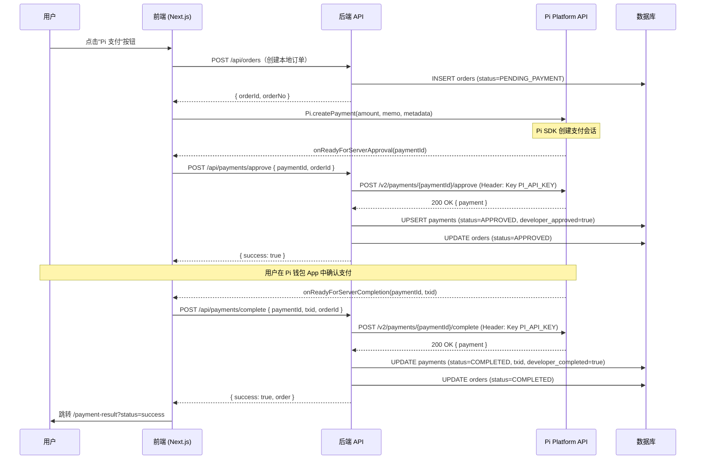

# Pi 支付流程文档

> 适用范围：Pi Merchant Framework — U2A (User-to-App) 支付流程  
> 最后更新：2026-04

---

## 概述

Pi Network 的 U2A 支付需要**前端、后端、Pi Platform API** 三方协作完成。核心要点：

1. **双重确认机制**：前端创建支付后，必须有后端 Approve + Complete 两步，缺一不可。
2. **安全性**：`PI_API_KEY` 只能在服务端使用，禁止暴露给前端。
3. **幂等性**：所有 API 操作必须支持重试（使用 `pi_payment_id` 作为唯一 key）。
4. **断线重做**：必须实现 `onIncompletePaymentFound` 处理旧的未完成支付。

---

## 支付流程时序图



---

## 每步详细说明

### 步骤 0：前提条件

- 前台必须在 **Pi Browser** 中运行（否则 `window.Pi` 为 `undefined`）
- 后端必须持有有效的 `PI_API_KEY`（从 Pi Developer Portal 获取）
- 数据库中必须已存在该用户的 `customers` 记录

---

### 步骤 1：创建本地订单

```typescript
POST /api/orders
Body: { serviceId, amount }
Response: { order: { id, orderNo, status: "PENDING_PAYMENT" } }
```

在触发 Pi SDK 之前先创建本地订单，目的：
- 记录用户意图，即使支付失败也有追踪
- 拿到 `orderId` 后塞入 Pi 支付的 `metadata`

---

### 步骤 2：前端调用 Pi.createPayment()

```typescript
window.Pi.createPayment(
  {
    amount: 5.0,           // Pi 金额
    memo: "购买：美甲服务",  // 用户在 Pi 钱包中看到的说明
    metadata: { orderId }, // 开发者自定义字段
  },
  callbacks
);
```

Pi SDK 会弹出 Pi 钱包界面，等待用户操作。

---

### 步骤 3 & 4：服务器审批 (Server Approval)

```
onReadyForServerApproval(paymentId) → POST /api/payments/approve
```

后端收到请求后：
1. 用 `PI_API_KEY` 调用 `POST /v2/payments/{paymentId}/approve`
2. 将 `payments` 记录落库（`developer_approved = true`）
3. 更新 `orders.status = APPROVED`

**⚠️ 重要**：此步骤必须快速响应（Pi SDK 有超时限制），禁止做耗时操作。

---

### 步骤 5：用户在 Pi 钱包确认支付

用户在 Pi 钱包 App 中点击确认，链上交易广播。这一步由 Pi Network 自动处理。

---

### 步骤 6 & 7：服务器完成 (Server Completion)

```
onReadyForServerCompletion(paymentId, txid) → POST /api/payments/complete
```

后端收到请求后：
1. 用 `PI_API_KEY` 调用 `POST /v2/payments/{paymentId}/complete`（传入 `txid`）
2. 更新 `payments`：`txid`、`status = COMPLETED`、`developer_completed = true`
3. 更新 `orders.status = COMPLETED`

---

### 步骤 8：跳转支付结果页

前端在 `onSuccess` 回调中跳转：

```typescript
router.push(`/payment-result?status=success&orderId=${orderId}`);
```

---

## 异常处理

### 场景 1：未完成支付（断网/用户关闭 App）

在 `Pi.authenticate()` 时，Pi SDK 会通过 `onIncompletePaymentFound` 回调返回上次未完成的支付。

```typescript
// auth-service.ts
await window.Pi.authenticate(scopes, async (payment) => {
  await handleIncompletePayment(payment); // payment-service.ts 中已实现
});
```

处理逻辑：
- 若 `developer_approved = false` → 重新 Approve
- 若 `developer_approved = true` 且 `txid` 存在 → 重新 Complete
- 若 `user_cancelled = true` → 更新本地状态为 CANCELLED

### 场景 2：用户取消支付

```
onCancel(paymentId) → POST /api/payments/cancel
```

后端将 `payments.status = CANCELLED`，`orders.status = CANCELLED`。

### 场景 3：Pi Platform API 返回 5xx

在 Approve/Complete 接口中已加入错误处理，返回 HTTP 502，前端应提示用户重试。

---

## 支付状态机

```
DRAFT
  └─► PENDING_PAYMENT  (订单创建)
        └─► PENDING_APPROVAL  (Pi SDK 触发)
              └─► APPROVED       (后端 Approve)
                    └─► COMPLETED   (后端 Complete) ← 链上确认
                    └─► FAILED      (Pi Platform 拒绝)
              └─► CANCELLED     (用户取消)
  └─► REFUNDED         (A2U 退款，P2 功能)
```

---

## 安全规范

| 规则 | 原因 |
|------|------|
| `PI_API_KEY` 仅在服务端使用 | 防止前端暴露导致被盗用 |
| `pi_payment_id` 数据库设 `@unique` | 防止重复支付到账 |
| Approve 接口做幂等处理 | 网络重试不产生副作用 |
| Complete 接口验证 `txid` | 防止伪造支付结果 |
