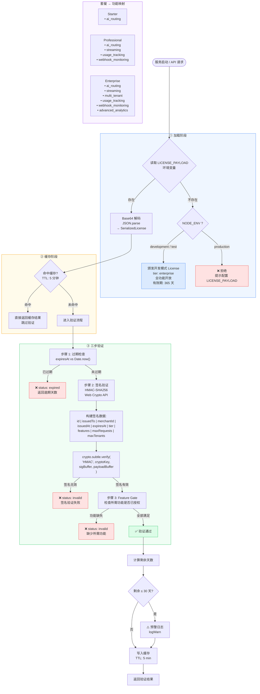
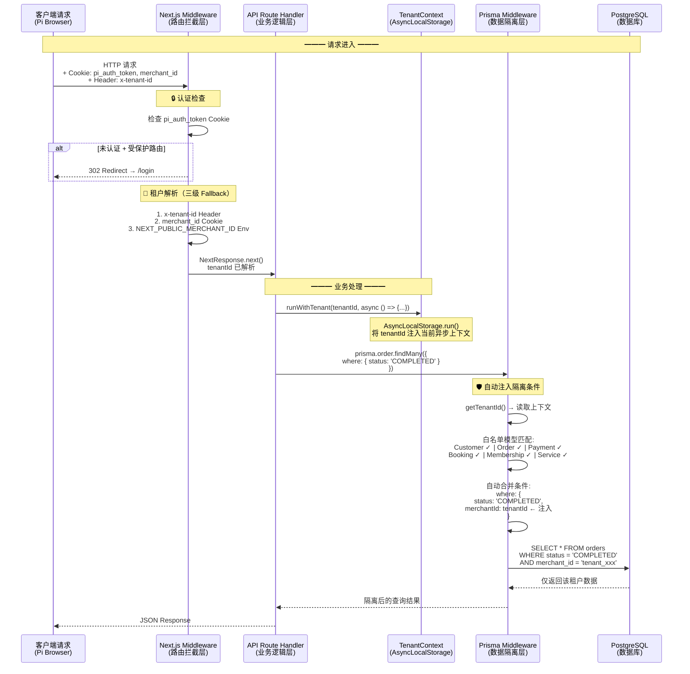
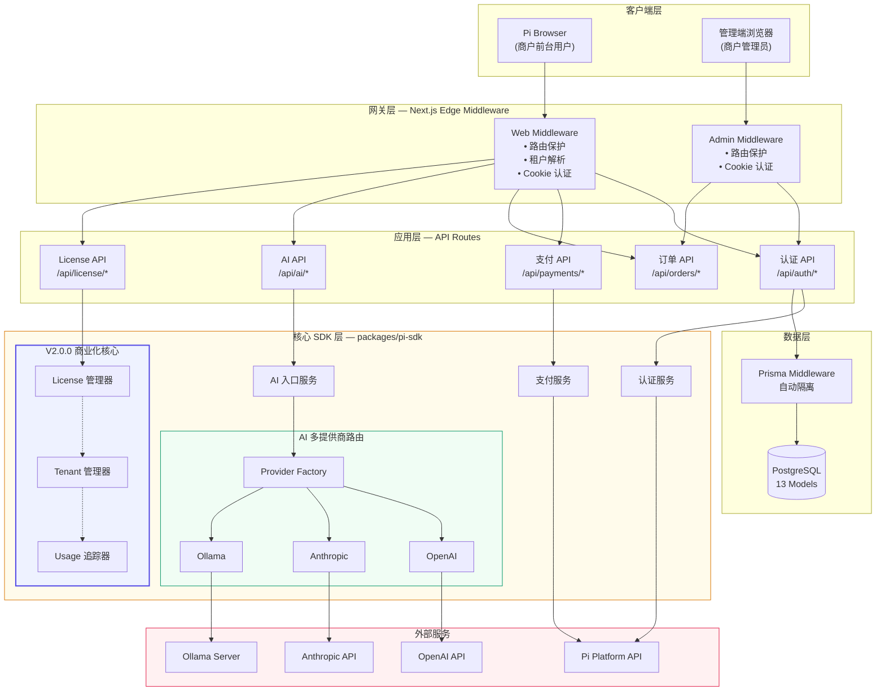

# Pioneer AI 用户手册 V2.0.0 — 补充材料

> 以下内容建议插入到用户手册 V2.0.0 第 5 章"商业化核心能力"中，作为架构图补充。

---

## 5.1.1 License 授权验证流程图

---

## 5.2.1 多租户数据隔离流程图

---

## 5.4 系统架构全景图

---

*以上内容为 V2.0.0 用户手册补充材料，包含授权流程图、多租户架构图和系统全景图。*
